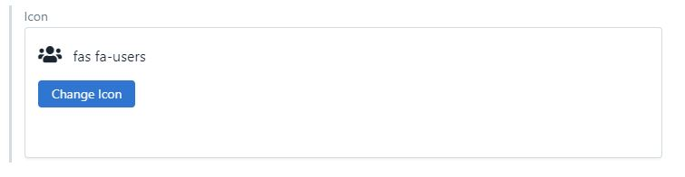
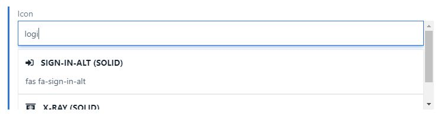

# Font Awesome Autocomplete Field

Text field app that makes it easy for editors to pick fontawesome icons.





This project was bootstrapped with [Create Contentful App](https://github.com/contentful/create-contentful-app).

## Setup

Install dependencies

```
npm install
```

Navigate to `public/index.html` and replace the fontawesome script with the one provided in your fontawesome dashboard

## Usage

```bash
# run dev server
npm start

# build for production
npm run build
```

## Libraries to use

To make your app look and feel like Contentful use the following libraries:

-   [Forma 36](https://f36.contentful.com/) – Contentful's design system
-   [Contentful Field Editors](https://www.contentful.com/developers/docs/extensibility/field-editors/) – Contentful's field editor React components

## Learn More

[Read more](https://www.contentful.com/developers/docs/extensibility/app-framework/create-contentful-app/) and check out the video on how to use the CLI.

Create Contentful App uses [Create React App](https://create-react-app.dev/). You can learn more in the [Create React App documentation](https://facebook.github.io/create-react-app/docs/getting-started) and how to further customize your app.
